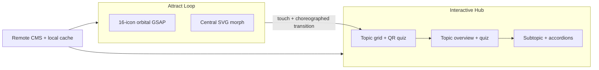

# MOAF Personal Finance Kiosk — Portfolio Marketing Outline

## Positioning (one-liner)

**A production touchscreen kiosk for the Museum of American Finance that turns personal finance education into a motion-driven exhibit experience — CMS-updatable, offline-resilient, and built for unattended museum deployment.**

This sits naturally on your [Web Development portfolio page](https://alexbouthillier.com/work/web-dev) alongside Hencove and Haverford Trust: same GSAP/SVG motion DNA, but a different platform story (Electron kiosk vs. WordPress). That contrast is a strength, not a gap.

---

## Big Picture — Lead With These (4 pillars)

### 1. Museum-grade experiential kiosk (the "what")

- **Client/context:** Built for the **Museum of American Finance (MOAF)** — a real, public-facing exhibit, not a demo app.
- **Purpose:** Teaches visitors *"The Essential Parts of Personal Finance"* through a browsable topic hierarchy, expandable reference content, and inline quizzes that link out to the Personal Finance Institute.
- **Why it matters for your portfolio:** Shows you ship production software for physical spaces — touch UX, idle attract loops, and content depth that has to work without a mouse, keyboard, or responsive breakpoints.

### 2. Motion design as the product (the "wow")

- **Attract screen centerpiece:** Triple concentric orbital rings with **16 finance topic icons** orbiting on GSAP `MotionPathPlugin` paths, gradient ring strokes, and SVG mask "holes" punched where icons pass — implemented in [`AttractOrbitGsap.tsx`](src/renderer/components/AttractOrbitGsap.tsx) + [`attractOrbitConstants.ts`](src/renderer/utils/attractOrbitConstants.ts).
- **Central morphing figure:** Cycles demographic silhouettes (man, elderly, family, woman, mother) via **MorphSVGPlugin** — [`attractCentralMorph.ts`](src/renderer/utils/attractCentralMorph.ts).
- **Choreographed transitions:** Attract → hub handoff animates the heading into its final position before routing; every screen (`FinanceA1` → `A3` → `A4`) has coordinated GSAP entrance/exit timelines.
- **Portfolio angle:** Directly extends your Hencove story (MotionPath, MorphSVG) into a React/Electron context. Your attract-screen video is the single best asset for this card.

### 3. Electron kiosk architecture (the "how it's built")

- **Stack:** Electron 41 + React 19 + TypeScript + electron-vite, with a hardened preload bridge (`contextIsolation`, no `nodeIntegration`).
- **True kiosk behavior:** Fullscreen deployment, idle timeout back to attract loop, multi-display placement — built for hardware that runs unattended.
- **Offline-resilient CMS:** Main process fetches from MOAF's CMS, caches JSON + materializes topic icons to disk, falls back gracefully when network/auth fails ([`src/main/cms.tsx`](src/main/cms.tsx)).
- **Portfolio angle:** Demonstrates full-stack ownership beyond front-end motion — IPC design, build-time credential inlining, NSIS packaging, and a custom DateVer release pipeline ([`scripts/upload-release.cjs`](scripts/upload-release.cjs)).

### 4. CMS-driven content platform (the "why it scales")

- Editorial content (topics, subtopics, dropdown reference pages, quiz Q&A) lives in a remote CMS — the app is a polished shell that content teams can update without redeploying.
- **React Markdown** pipeline with custom internal linking between topics/subtopics ([`markdownLinks.tsx`](src/renderer/utils/markdownLinks.tsx)) — visitors can jump across the curriculum without losing context.
- **Portfolio angle:** Shows you think about maintainability and non-developer stakeholders, not just animation polish.



---

## Additional Call-Outs (pick 5–8 for tags or body copy)

| Call-out | One-line hook |
|----------|---------------|
| **GSAP MotionPath orbital system** | Computed SVG motion paths, per-ring icon counts (8/12/16), synchronized mask holes |
| **GSAP MorphSVG lifecycle icons** | Multi-path morph timelines across 5 demographic silhouettes |
| **View Transitions API** | [`navigateWithTransition()`](src/renderer/utils/navigateWithTransition.ts) wraps React Router for smoother route changes |
| **Touch-native UX constraints** | Fixed 1920×1080, no hover states, scroll-fade masks on long panels ([`useScrollFadeMask`](src/renderer/hooks/useScrollFadeMask.ts)) |
| **Accordion dropdown choreography** | GSAP height/opacity + auto-scroll-into-view on expand in FinanceA4 |
| **Inline quiz micro-interactions** | Correct/wrong feedback with decaying horizontal wiggle on wrong answers |
| **4-tone topic grid system** | Color-coded topic buttons that rotate by grid position — visual wayfinding at kiosk scale |
| **Three.js GLSL shaders** | Custom wave/glow canvas ([`WobbleCanvas.tsx`](src/renderer/components/WobbleCanvas.tsx)) — optional "depth" mention |
| **BEM SCSS architecture** | Consistent component styling across 4+ screen types |
| **Fleet release pipeline** | DateVer auto-bump → electron-vite build → NSIS installer → zip publish for OTA updates |

**Recommended tag row** (matches your existing pill format on the web-dev page):

`Electron` · `React 19` · `TypeScript` · `GSAP MotionPath` · `GSAP MorphSVG` · `SVG` · `CMS` · `electron-vite`

Optional additions if space allows: `View Transitions API` · `Three.js`

---

## Double-Width Card Concept

Your existing projects are single-column cards with title, platform line, tag pills, paragraph, and "Visit Site." This project warrants breaking that pattern — the attract animation is cinematic and the technical depth exceeds a single paragraph.

### Recommended layout

```
┌─────────────────────────────────────────────────────────────────────┐
│  [ LOOPING VIDEO — attract orbital animation, full card width ]     │
│  (muted autoplay, no controls; fallback: static hero still)         │
├──────────────────────────────┬──────────────────────────────────────┤
│  MOAF Personal Finance Kiosk │  Electron (Custom Kiosk App)         │
│                              │  [tag pills row]                     │
│                              │                                      │
│                              │  2–3 sentence lead paragraph         │
│                              │                                      │
│                              │  • bullet: orbital attract system    │
│                              │  • bullet: CMS + offline cache       │
│                              │  • bullet: choreographed screen flow │
│                              │                                      │
│                              │  [ Visit Exhibit ] (if public URL)   │
└──────────────────────────────┴──────────────────────────────────────┘
```

**CSS approach:** `grid-column: span 2` on a 2-column project grid (or `span 3` on a 3-column grid). Video sits above the text block at full width — the motion sells the piece before anyone reads.

### Video guidance (you have footage ready)

- **Capture:** 10–15s loop of the attract screen — orbital icons + central morph ideally in the same clip.
- **Crop:** 16:9 or ~2:1 cinematic crop; the orbital system is centered in [`Attract.tsx`](src/renderer/components/Attract.tsx).
- **Export:** WebM + MP4, under ~3MB if possible (portfolio performance).
- **Fallback still:** One frame of the hub screen (`FinanceA1` topic grid) shows the content depth beyond the attract loop.

### Draft copy (starting point)

**Title:** MOAF Personal Finance Kiosk

**Platform line:** Electron (Custom Kiosk App)

**Lead paragraph:**

> Built for the Museum of American Finance, this touchscreen exhibit teaches visitors the essential parts of personal finance through a motion-driven attract loop and a CMS-powered content experience. Sixteen topic icons orbit on GSAP motion paths around a morphing central figure, drawing visitors in before they explore topics, subtopics, reference content, and inline quizzes — all updatable from a remote CMS without redeploying the app.

**Secondary bullets (optional, below paragraph):**

- Triple-ring orbital animation with gradient strokes and synchronized SVG mask holes
- Offline-resilient CMS architecture with local cache and icon materialization
- Choreographed GSAP transitions across attract, topic hub, and detail screens
- Production Electron kiosk: hardened IPC, NSIS installer, fleet OTA release pipeline

**CTA:** "Visit Exhibit" only if there is a public URL or case-study page; otherwise omit or link to a MOAF page about the exhibit. No fabricated link.

---

## How This Differentiates on Your Page

| Your existing pieces | MOAF kiosk adds |
|---------------------|-----------------|
| WordPress / Webflow CMS sites | Native Electron kiosk app |
| Scroll-driven web animations | Always-on attract loop + idle timeout |
| Marketing/conversion focus | Educational exhibit + quiz integration |
| Browser deployment | Windows kiosk hardware + OTA fleet updates |

The double-width treatment signals "flagship project" without needing to say it — the video does the heavy lifting, the copy confirms the engineering depth.

---

## Suggested Implementation Order (when you build the page)

1. Export and optimize attract-loop video (WebM + MP4 + poster still)
2. Add double-width grid variant to the web-dev project component
3. Insert MOAF card as the **first or second item** on the page (above the fold impact)
4. Wire tag pills and copy from the draft above
5. Optional: add a second still (hub screen) as a small inset or hover state to show content depth beyond the attract loop
